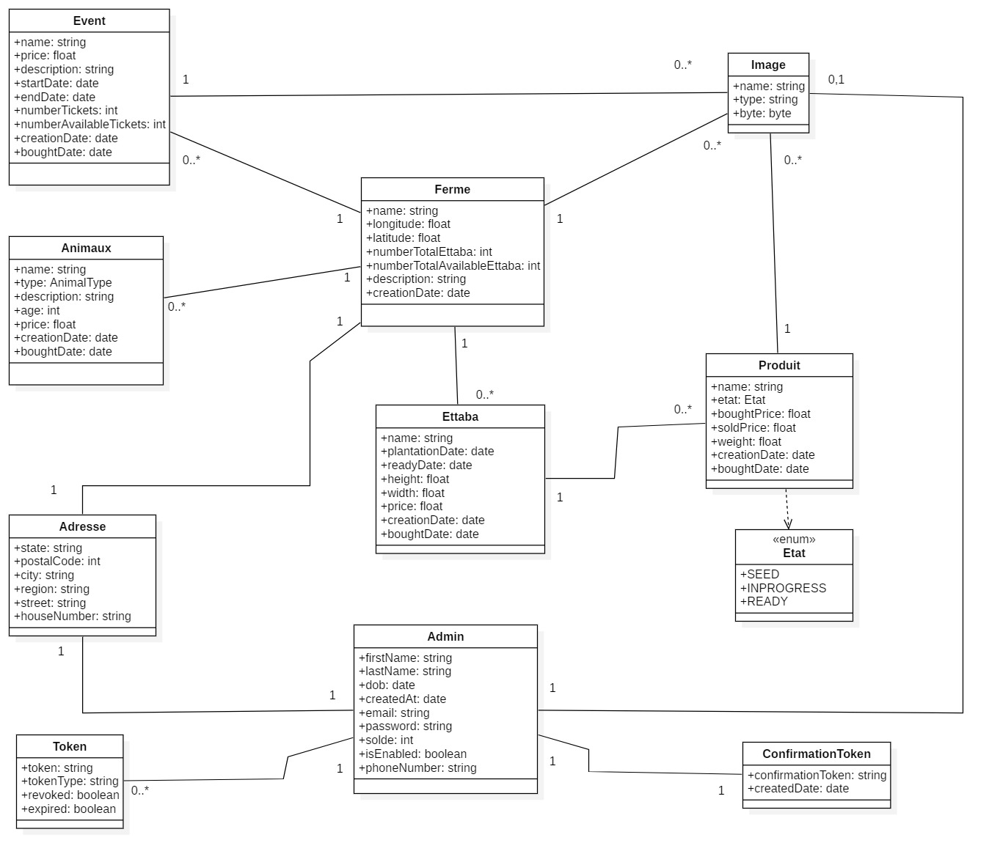

# Spring Boot - Internship project
For the summer internship project in the web application developement: ETTABA

## Class Diagram




## Requirements

For building and running the application you need:

- [JDK 17](https://www.oracle.com/java/technologies/downloads/?er=221886#java17)

## Running the application locally

There are several ways to run a Spring Boot application on your local machine.
One way is to execute the `main` method in the `com.intern.backendettaba.BackendEttabaApplication` class from your IDE.

Alternatively you can use the [Spring Boot Maven Wrapper plugin](https://maven.apache.org/wrapper/) like so:

```shell
./mvnw spring-boot:run
```
## Browser URL
Open your browser at the following URL for Swagger UI (giving REST interface details):

http://localhost:8082/swagger-ui/index.html 

